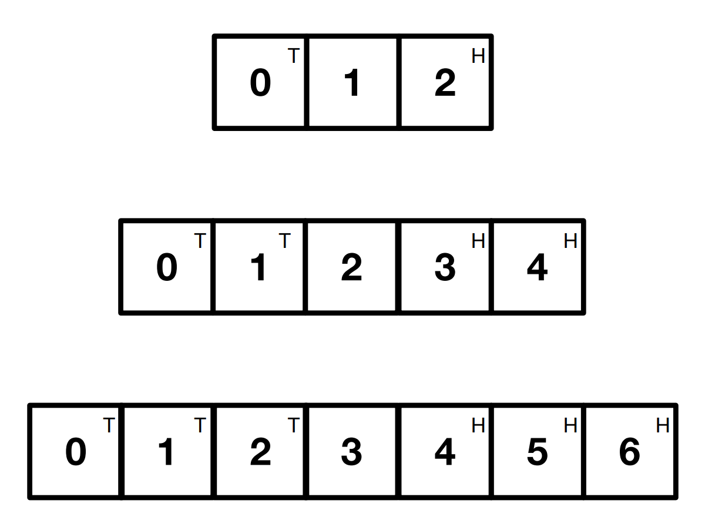

## What is computational thinking?

Computational thinking allows us to take a complex problem, understand what the problem is and develop possible solutions designed in a way that a computer, a human, or both, would understand how to implement. 

Thinking computationally differs from programming in that programming tells a computer what to do and how to do it. Computational thinking enables you to work out exactly what to tell the computer to do.
Real computational tasks are complicated. To accomplish them you need to **THINK BEFORE YOU CODE**.

In small groups discuss what you think the most important elements to think about before writing a program are: 
 * question to prompt

-----

## 1. What is an algorithm? What is a program?

An algorithm is a sequence of steps that solve a specific problem. A program is a sequence of instructions that tells the computer to do something. They differ from each other in that an algorithm will solve the problem while a program implements an algorithm in a form that a computer can execute.

Although we might think of algorithms as complicated things used by programmers, in fact algorithms are essentially used by people everyday to complete tasks and can be incredibly simple. The method of a carbonara recipe is a sort of algorithm designed to assemble certain elements into a meal. 

### 1.1 Implementation vs algorithm

Being an efficient programmer is not only about writing code - it is about solving problems in a way that is translatable to a computer. Often what people think of as a problem with code writing is in fact a problem with the algorithm. Consider the exercise below:

🏃‍♀️ **Activity: Addition** 

Create a program that asks a user for x and y values and then returns the sum of them.

```
x=input('X = ')
y=input('Y = ')
print(x+y)
```

Hmm... did we tell it what to do incorrectly? Or did we tell it to do the wrong thing?
Try adding 'computational' and 'thinking'. What is the difference between these types of input? Clue: type()

```
print('computational'+'thinking')
```

Often what we think are issues with implementation are actually issues of algorithm.


### 1.2 Understanding algorithms

A simple way to represent an algorithm can be through a flowchart. Looking at the representation of a car park below, by following the steps of the flowchart you should be able to find out how many cars are at the exit, entrance and inside at the end.


### 1.3 Creating algorithms

🏃‍♀️ **Activity: Snakes, ladders & flowcharts**

Snakes and ladders is dice game where players advance along the board based on the roll of the dice. Upon landing on a board square a player may either encounter a snake, where they are forced backwards a number of squares, a ladder, where they advance a number of squares, or nothing, in which case they remain on that square. A player wins when they reach the end of the board.

Design a flowchart for the game. The total number of board squares should be 100, and the maximum number of squares a player is advanced or returned should be 30.

If you want to create the flowchart online you can use this website (used to create the above flowchart)

-----

When designing an algorithm there are certain elements that make algorithmic problem-solving more efficient:
* decomposition
* pattern recognition
* abstraction

-----

## 2. Decomposition

Decomposition refers to the process of breaking down a complex problem into smaller, simpler subproblems. The idea is to solve each subproblem independently 
and then combine the solutions to obtain a solution to the original problem. This allows for the creation of more efficient and manageable algorithms by 
reducing the complexity of the problem and making it easier to identify and solve individual parts. Equally, this makes your code more reusable as each function 
solves a smaller issue which may be relevant elsewhere. 


🏃‍♀️ **Activity: Caesar cypher** 

In cryptography, a Caesar cipher is a very simple encryption technique in which each letter in the plain text is replaced by a letter some fixed number of positions down the alphabet. For example, with a shift of 3, A would be replaced by D, B would become E, and so on. The method is named after Julius Caesar, who used it to communicate with his generals. ROT-13 ("rotate by 13 places") is a widely used example of a Caesar cipher where the shift is 13. In Python, the key for ROT-13 may be represented by means of the following dictionary:

```
key = {'a':'n', 'b':'o', 'c':'p', 'd':'q', 'e':'r', 'f':'s', 'g':'t', 'h':'u', 
       'i':'v', 'j':'w', 'k':'x', 'l':'y', 'm':'z', 'n':'a', 'o':'b', 'p':'c', 
       'q':'d', 'r':'e', 's':'f', 't':'g', 'u':'h', 'v':'i', 'w':'j', 'x':'k',
       'y':'l', 'z':'m', 'A':'N', 'B':'O', 'C':'P', 'D':'Q', 'E':'R', 'F':'S', 
       'G':'T', 'H':'U', 'I':'V', 'J':'W', 'K':'X', 'L':'Y', 'M':'Z', 'N':'A', 
       'O':'B', 'P':'C', 'Q':'D', 'R':'E', 'S':'F', 'T':'G', 'U':'H', 'V':'I', 
       'W':'J', 'X':'K', 'Y':'L', 'Z':'M'}
```

In R, this dictionary is equivalent to the dataframe:

```
key <- data.frame(start = letters, 
                  shift = c(letters[14:26],
                            letters[1:13]))
```


Your task in this exercise is to implement an encoder/decoder of ROT-13. Once you're done, you will be able to read the following message:

```
Pnrfne pvcure? V zhpu cersre Pnrfne fnynq!
```

How does the idea of decomposition apply here? What would you do to implement this?

Credits: [Torbjorn Lager](https://www.gu.se/en/about/find-staff/torbjornlager)

-----

## 3. Pattern recognition

Pattern recognition involves finding the similarities or patterns among small, decomposed problems that can help us solve complex problems more efficiently. Once a problem has been broken down into simpler subproblems, there may be similarities among these that mean we do not have a write a solution twice. These patterns may exist both between and within individual problems.

🏃‍♀️ **Activity: The swap puzzle** 

Place small coins heads up on the squares marked H and tails up on the squares marked T.
Swap the positions of the Heads for the Tails in as few moves as possible.

There are two ways to move a piece:
1. Move left or right to an adjacent empty square
2. Jump over a single adjacent piece into an empty space.

There are three increasingly larger boards that get harder. Complete the first in 3 moves, the second in 8 moves
and the third in 15 moves.




🏃‍♀️ **Activity: Lost in translation** 

Here's a simple real-world application from the field of bioinformatics. Genetic information is stored in DNA, which is a sequence of 4 bases (the nucleotides, conventionally indicated by the uppercase letters A, C, T, G). Thus a part of a gene might look like the string "GATTACA". During translation, molecular machinery converts the genetic sequence to a string of amino acids constituting a protein. In particular, DNA is read as a sequence of three-letter long "words" (the codons), each of which identifies an amino acid. So a sequence like "ATACAACCTGGTTCA" would be segmented as "(ATA)(CAA)(CCT)(GGT)(TCA)" and translated to "IQPGS", according to the standard genetic code (see also the dictionary below). In reality, these sequences are a few thousand characters long, hence the need for bioinformatics. Happily, if we discard all the chemistry, this is just straightforward string processing.

Write a program that asks the user for a nucleotide sequence and translates it into aminoacids. Use the genetic code table given below as a dictionary to look up the codons and perform the translation.

```
# The standard genetic code
gencode = {
    'ATA':'I', 'ATC':'I', 'ATT':'I', 'ATG':'M',
    'ACA':'T', 'ACC':'T', 'ACG':'T', 'ACT':'T',
    'AAC':'N', 'AAT':'N', 'AAA':'K', 'AAG':'K',
    'AGC':'S', 'AGT':'S', 'AGA':'R', 'AGG':'R',
    'CTA':'L', 'CTC':'L', 'CTG':'L', 'CTT':'L',
    'CCA':'P', 'CCC':'P', 'CCG':'P', 'CCT':'P',
    'CAC':'H', 'CAT':'H', 'CAA':'Q', 'CAG':'Q',
    'CGA':'R', 'CGC':'R', 'CGG':'R', 'CGT':'R',
    'GTA':'V', 'GTC':'V', 'GTG':'V', 'GTT':'V',
    'GCA':'A', 'GCC':'A', 'GCG':'A', 'GCT':'A',
    'GAC':'D', 'GAT':'D', 'GAA':'E', 'GAG':'E',
    'GGA':'G', 'GGC':'G', 'GGG':'G', 'GGT':'G',
    'TCA':'S', 'TCC':'S', 'TCG':'S', 'TCT':'S',
    'TTC':'F', 'TTT':'F', 'TTA':'L', 'TTG':'L',
    'TAC':'Y', 'TAT':'Y', 'TAA':'_', 'TAG':'_',
    'TGC':'C', 'TGT':'C', 'TGA':'_', 'TGG':'W'}
```

How can you use the ideas of decomposition and pattern recognition to help you to write this? Is this similar to anything you have written before?

Credits: [Fabrizio Smeraldi](https://github.com/fsmeraldi/cp-flowcontrol/blob/master/Flow_Control-Exercises.ipynb)


### 3.1 Iteration

Once you have recognised a pattern, you may either be able to reuse a previously written function to help solve a different problem, or it may be that you can iterate the same solution.... 

-----

## 4. Abstraction

Programming is about creating and composing abstractions. Abstraction works by establishing a level of complexity at which a person interacts with a system, suppressing the more complex details below the current level. Abstraction allows programmers to define objects and functions that can interact with each other in a predictable way without having to understand the underlying details of their implementation. 

If you see a simple interface covering a more complex implementation, this is abstraction. For example:
* The interface of a car is simple; a steering wheel, accelerator, brake and gear stick. However, these cover a much more complex machine. You learn that to press the accelerator makes the car go faster but will not be taught how the acceleration actually works - because the details of this are not important for you to drive the car.

Abstraction can also be used to simplify problems. By ignoring information that is not essential to the way your program works, it is easier to write a solution. 

🏃‍♀️ **Activity: Tour Guide**

Imagine that you are a hotel tour guide. Tourists staying in your hotel expect to be taken on a tour visiting all the city’s attractions. Using the below map showing locations of all the attractions and how you can get from one to another, you must work out a route that starts from the hotel and takes your tour group to every tourist site. The tourists will be unhappy if they pass through the same place twice. They also want to end up back at their hotel that evening. How would you solve this?


🏃‍♀️ **Activity: Knight's Tour**

On the cross shaped board below, a chess Knight can move two spaces in one direction and then move one square at right angles, or vice versa, as it moves in a chessgame. It jumps to the new square without visiting any in between, and must always land on a square on the board. Find a sequence of moves that starts from Square 1, visits every square exactly once and finishes where it started.


Are these problems similar? How might you represent the Knight's Tour in a different way to simplify finding a solution?

-----

## Take-home messages:


