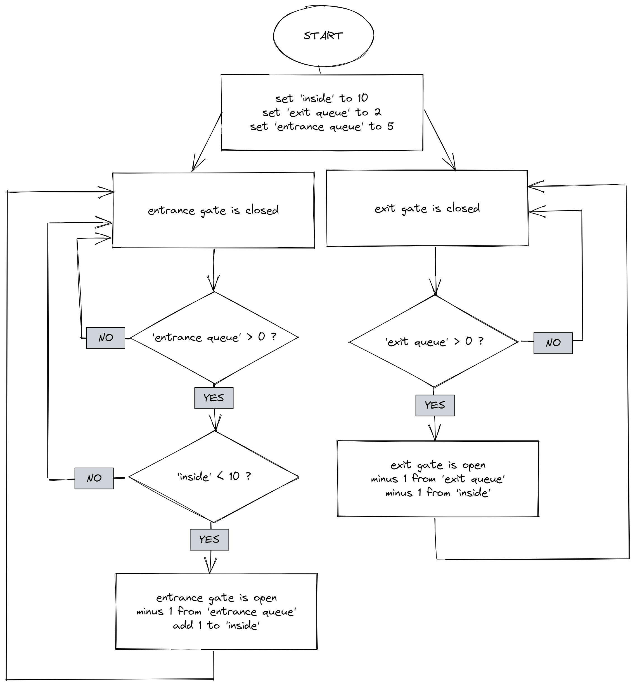
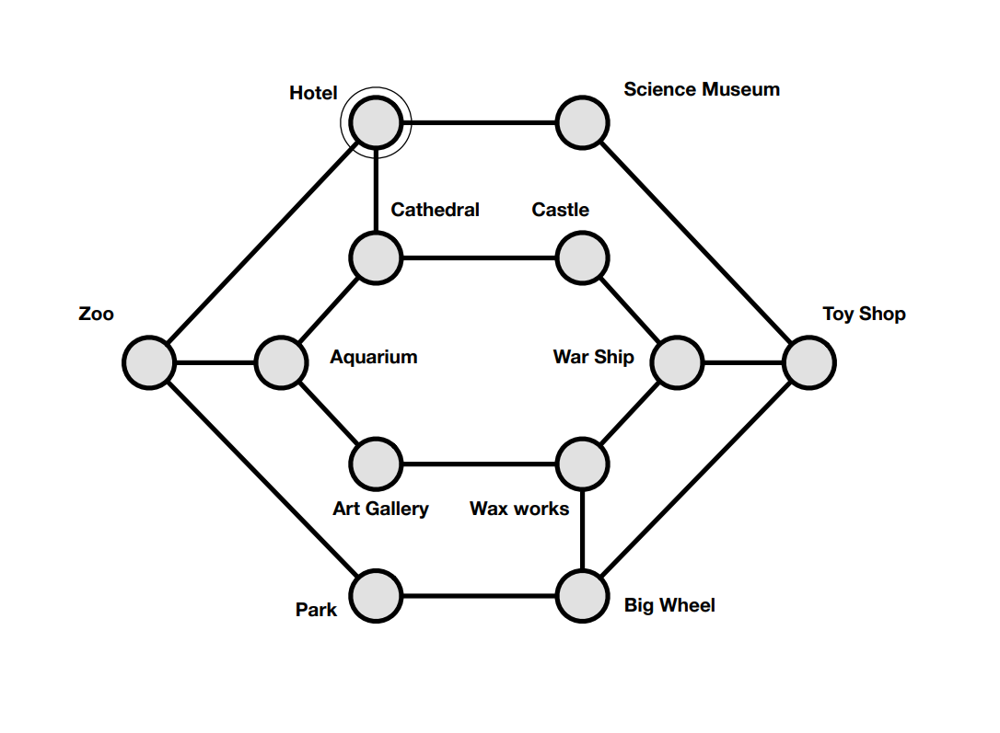
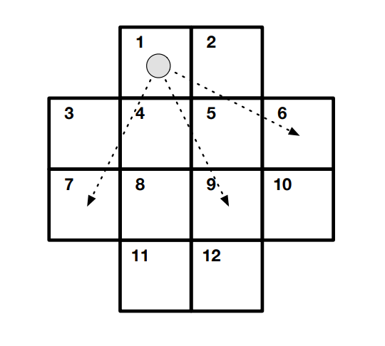

## What is computational thinking?

Computational thinking allows us to take a complex problem, understand what the problem is and develop possible solutions designed in a way that a computer, a human, or both, would understand how to implement. 

Thinking computationally differs from programming in that programming tells a computer what to do and how to do it. Computational thinking enables you to work out exactly what to tell the computer to do.
Real computational tasks are complicated. To accomplish them you need to **THINK BEFORE YOU CODE**.

In small groups discuss what you think the most important elements to think about before writing a program are. 
 * question to prompt


When designing an algorithm there are certain elements that make algorithmic problem-solving more efficient:
* decomposition
* pattern recognition
* abstraction


## 1. What is an algorithm? What is a program?

An algorithm is a sequence of steps that solve a specific problem. A program is a sequence of instructions that tells the computer to do something. They differ from each other in that an algorithm will solve the problem while a program implements an algorithm in a form that a computer can execute.

### 1.1 Implementation vs algorithm

Being an efficient programmer is not only about writing code - it is about solving problems in a way that is translatable to a computer. Often what people think of as a problem with code writing is in fact a problem with the algorithm. Consider the exercise below:

🏃‍♀️ **Activity: addition** 

Create a program that asks a user for x and y values and then returns the sum of them.

```
x=input('X = ')
y=input('Y = ')
print(x+y)
```

Hmm... did we tell it what to do incorrectly? Or did we tell it to do the wrong thing?
Often what we think are issues with implementation are actually issues of algorithm.

Now try adding 'computational' and 'thinking'. What is the difference between these types of input? Clue: type()

```
print('computational'+'thinking')
```

### 1.2 Understanding algorithms

A simple way to represent an algorithm can be through a flowchart. Looking at the representation of a car park below, by following the steps of the flowchart you should be able to find out how many cars are at the exit, entrance and inside at the end.

<center><center>

  
## 2. Decomposition

Decomposition refers to the process of breaking down a complex problem into smaller, simpler subproblems. The idea is to solve each subproblem independently 
and then combine the solutions to obtain a solution to the original problem. This allows for the creation of more efficient and manageable algorithms by 
reducing the complexity of the problem and making it easier to identify and solve individual parts. Equally, this makes your code more reusable as each function 
solves a smaller issue which may be relevant elsewhere. 

🏃‍♀️ **Activity: decomposing fungi** 


## 3. Pattern recognition

Pattern recognition involves finding the similarities or patterns among small, decomposed problems that can help us solve more complex problems more efficiently. Once a problem has been broken down into simpler subproblems, there may be similarities among these subproblems that mean we do not have a write a solution twice. These patterns may exist both between and within individual problems.

  

## 4. Abstraction

Programming is about creating and composing abstractions. Abstraction works by establishing a level of complexity at which a person interacts with a system, suppressing the more complex details below the current level. Abstraction allows programmers to define objects and functions that can interact with each other in a predictable way without having to understand the underlying details of their implementation. 

If you see a simple interface covering a more complex implementation, this is abstraction. For example:
* The interface of a car is simple; a steering wheel, accelerator, brake and gear stick. However, these cover a much more complex machine. You learn that to press the accelerator makes the car go faster but will not be taught how the acceleration actually works - because the details of this are not important for you to drive the car.

Abstraction can also be used to simplify problems. By ignoring information that is not essential to the way your program works, it is easier to write a solution. 

🏃‍♀️ **Activity: Tour Guide**

Imagine that you are a hotel tour guide. Tourists staying in your hotel expect to be taken on a tour visiting all the city’s attractions. Using the below map showing locations of all the attractions and how you can get from one to another, you must work out a route that starts from the hotel and takes your tour group to every tourist site. The tourists will be unhappy if they pass through the same place twice. They also want to end up back at their hotel that evening. How would you solve this?



🏃‍♀️ **Activity: Knight's Tour**

On the cross shaped board below, a chess Knight can move two spaces in one direction and then move one square at right angles, or vice versa, as it moves in a chessgame. It jumps to the new square without visiting any in between, and must always land on a square on the board. Find a sequence of moves that starts from Square 1, visits every square exactly once and finishes where it started.



Are these problems similar? How might you represent the Knight's tour in a different way to simplify finding a solution?

